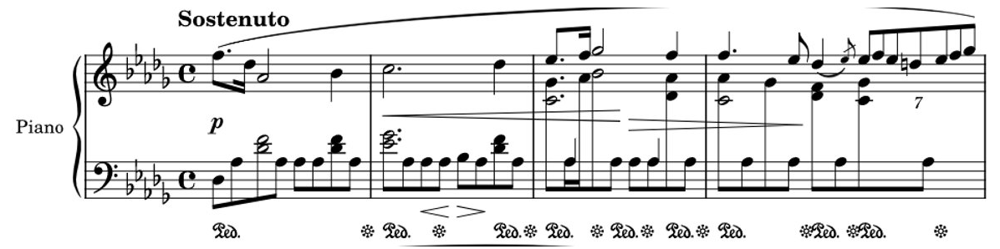

# NN+NLP Project

### Team members
* Jakub Kuciński
* Wojciech Fica
* Jakub Dworzański

### Project title
Musical notes generation

## Description
We build NN models that generate subsequent musical notes when given some (short) initial sequence of notes.

What we wanted to achieve and why:
- always wanted to be a musician but didn’t have the talent​
- see if we can produce good quality music​
- it was a new and challenging topic
- AI should be able to generate music

Was there any challenge?​
- Seemed similar to Language Modelling ​
- Yet different:  music structure != language structure​
  - language sentence == a tree of words​
  - music == a flow of notes + … ​

### Data
[Lakh Pianoroll Dataset](https://salu133445.github.io/lakh-pianoroll-dataset/?fbclid=IwAR0_N-3A5eHLrA8_HtYadnUvfOcdzugzHyiOVpUqfEqaFSRXRFSeTQiCCC8) is a collection of 174,154 multitrack pianorolls derived from the Lakh MIDI Dataset (LMD).

Data preparation:

How to turn 
 
into tokens?

- Brainstormed a few approaches used in the field.​
- Chose the simplest one. ​

Sample encoding:​

xxsep d34 n44 d2 n39 d6 n32 d2 ​

xxsep d1 n44 d2 n33 d3 ​

xxsep d2 n46 ...

that corresponds to 

### Models
RNN-based

- LSTM:

  - written and trained from scratch 

  - embedding_dim = 128, lstm_size = 256, num_layers=2, ...

Transformer-based:

- GPT2 (LMHeadModel)

    - wanted to finetune a model from a library

    - the tricky part: model was not trained on musical notes … 

    - so decided to train a mini GPT2 form scratch instead

    - n_ctx = 128, n_embd = 64, n_layer = 3, ...

### Success evaluation
Empirical - if model generates reasonably fine-sounding and fairly diverse songs based on different initial notes we would call it a success.

How to evaluate a notes-generating model?​

1. Does the generated music sound good? - YES

2. Is the model able to generate music or just remembered a few pieces? - YES

3. Perplexity:

  - LSTM perplexity:

  - GPT2 perplexity:

### Conclusions
What have you learned?​

- data preparation may get tricky and might require domain specific knowledge;​

- models take a long time and a lot of resources to train.​

​

What was good or bad?​

- good: the results were cool;​

- bad: didn't have enough time/resources to finish training the models.​

​

What could have been different?​

- encode more information when encoding notes to tokens.​

​

What could you do next?​

- expand it to handle multiple instruments.

### Examples
Examples with generated music in data/ directory.

### Literature
[Deep Learning Music Generation](https://cs230.stanford.edu/projects_fall_2019/reports/26258004.pdf)

[MuseNet](https://openai.com/blog/musenet/)

[Compound Word Transformer: Learning to Compose Full-Song Music cover Dynamic Directed Hypergraphs](https://arxiv.org/pdf/2101.02402v1.pdf)

